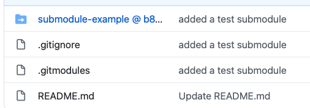

# git-submodule-test

# WDIR-Submodule-Test

Submodule References:

[Posted roughly 2011](https://chrisjean.com/git-submodules-adding-using-removing-and-updating/)

[Git official Documentation](https://chrisjean.com/git-submodules-adding-using-removing-and-updating/)

### Steps

- `git init` a new repo or use github to create a new repo
- `cd` into new repo
- get the url for the repo you'd like to make into a submodule, in our case the git branching and merging lesson `hfb` - `https://git.generalassemb.ly/Web-Development-Immersive-Remote/hfb.git`
- in the new repo
    - `git submodule add https://git.generalassemb.ly/Web-Development-Immersive-Remote/hfb.git`
    - `git commit -am 'added hfb'`
    - `git push origin master`

#### Github:
Sub module added:

Even though it looks a bit weird it is still accessible

Note the url - though the branch is master - how do updates work? Does it 'know' to update master or is that what the original article was referring to? About needing to explicitly do updates of submodules

#### Locally:

**In Terminal**

**In Atom**

### Add New Experimental Submodule to Try Updates

**Questions**
  - If I update from Github
    - How do I pull the changes down
    - Does the link automatically update to the latest version of master?
        - no, it does not
  - If I update locally, in Atom from the project tree within the submodule, what happens?
  - Can I move around my submodules into a different file structure that makes more sense to me?
  - How to clone with submodules?
      - [git docs](https://git-scm.com/book/en/v2/Git-Tools-Submodules)
        - `git clone` main repo
        - `git submodule init`
        - `git submodule update`
        or
        - `git clone --recurse-submodules https://github.com/chaconinc/MainProject`
